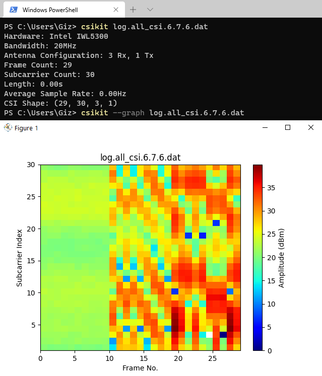

# CSIKit [](https://crate.io/packages/CSIKit/) [](https://pepy.tech/project/csikit)

Tools for extracting Channel State Information from formats produced by a range of WiFi hardware/drivers, written in Python with numpy.

Python 3.6+ required.

- **CSI parsing** from Atheros, Intel, Nexmon, ESP32, and PicoScenes (USRP, etc) formats.
- **Processing** and **Visualisation** using numpy and matplotlib.
- **CSV/JSON generators** for dataset serialisation.
- **Library** and **Tools** for parsing CSI for your own Python applications.

Documentation updates are incoming.

Don't have your own CSI data? Check out [CSI-Data](https://github.com/Gi-z/CSI-Data) for a collection of public CSI datasets.

<p align="center">
  
</p>

- [CSIKit](#csikit-)
  - [Description](#description)
  - [Installation](#installation)
  - [Example](#example)
    - [Command Line](#command-line)
    - [CSIKit library](#csikit-library)
  - [Library](#library)
  - [Using CSI Matrices](#using-csi-matrices)
    - [ATHCSIFrame](#athcsiframe)
    - [IWLCSIFrame](#iwlcsiframe)
    - [NEXCSIFrame](#nexcsiframe)
  - [Supported Hardware](#supported-hardware)
  - [Known Issues](#known-issues)
  - [Coming Soon](#coming-soon)
    - [Realtime Retrieval](#realtime-retrieval)
  - [Mistakes and Tests](#mistakes-and-tests)
  - [Reference Links](#reference-links)
  - [License](#license)

## Description

**CSIKit** is a framework aimed at assisting data scientists, researchers, and programmers with performing experiments and tests using CSI-capable WiFi hardware.

While the various public extraction toolkits do include scripts for parsing CSI data from their specific formats, these are largely written for MATLAB. Given the increasing focus on using deep learning in CSI experimentation, Python tools for parsing and processing CSI data may be more desirable for some. This is aimed at improving the accessibility of CSI research for those who may be interested in the area but have little experience with network engineering.

As is usually the case with research-oriented software, documentation is in-progress.

CSIKit provides a command line tool for parsing, processing, converting, and visualisation of CSI data, as well as libraries for use in other Python applications such as those working with Tensorflow, PyTorch, etc.

```console
csikit [OPTIONS] file[.pcap/.dat/.csv/.csi]
```

## Installation

CSIKit can be installed via pip or used directly from source.

```console
pip install csikit
```

## Example

### Command Line

```console
csikit log.all_csi.6.7.6.dat
csikit --graph --graph-type all_subcarriers log.all_csi.6.7.6.dat
csikit --csv log.all_csi.6.7.6.dat
```

### CSIKit library

Generic example:

```python
from CSIKit.reader import get_reader

my_reader = get_reader("path/to/csi_file.dat/pcap")
csi_data = my_reader.read_file("path/to/my_csi_file.dat/pcap")
```

<!-- Raspberry Pi 4 example:

```python
from CSIKit.reader import NEXBeamformReader

my_reader = NEXBeamformReader()
csi_data = my_reader.read_file("path/to/test.pcap")
``` -->

Hardware-specific (Intel IWL5300) example:

```python
from CSIKit.reader import IWLBeamformReader

my_reader = IWLBeamformReader()
csi_data = my_reader.read_file("path/to/log.all_csi.6.7.6.dat")
```

## Library

CSIKit exposes key components for use in other Python applications: `Reader` and `csitools`. As other sections of code become more refined, this will likely grow over time.

Note: This documentation is initial and brief. More will follow shortly.

A Reader is used to read a given CSI capture file and generate parsed traces and matrices. As each file format differs a significant amount, different readers are necessary for each piece of hardware. Using the `get_reader` method in `CSIKit.reader`, the correct reader can be automatically selected for a given file. Optionally, hardware-specific readers can be imported, as `ATHBeamformReader`, `IWLBeamformReader`, `NEXBeamformReader`, `CSVBeamformReader`, `PicoScenesBemaformReader`.

Once instantiated, a Reader can be used to read a file using the `read_file` method. This method returns a `CSIData` object, which contain frames (`CSIFrame` objects), timestamps, and metadata from parsing (errors, device information, etc). Additional parsing options can be passed to `read_file`, including `scaled` (bool) to rescale CSI values from manufacturer's internal scaling.

`CSIFrame`s will have a different type, based on the type of Reader used to parse them. All `CSIFrame`s contain a `csi_matrix` (being the most significant part of the payload), however they also contain additional attributes for each frame. Some attributes may be common across the different frame types, however they can vary significantly from one type to another. Next steps for this library are aimed at further integrating these standards. The full list of attributes associated with each frame are listed below.

## Using CSI Matrices

CSI matrices contain complex numbers representing the gain and phase of a signal at a given subcarrier. These are output in their complex form in `CSIFrame`s, however `csitools` contains a function for retrieving CSI amplitude from them.

```python
from CSIKit.reader import get_reader
from CSIKit.util import csitools

my_reader = get_reader("path/to/file.pcap")
csi_data = my_reader.read_file("path/to/file.pcap", scaled=True)
csi_matrix, no_frames, no_subcarriers = csitools.get_CSI(csi_data)
```

The returned tuple contains a modified matrix which contains CSI amplitudes in dBm, followed by the number of frames and subcarriers represented therein.

Once we have CSI amplitude data, we can also apply filters for preprocessing (as seen in many publications making use of CSI).

```python
from CSIKit.filters import lowpass, hampel, running_mean
from CSIKit.reader import get_reader
from CSIKit.util import csitools

my_reader = get_reader("path/to/file.pcap")
csi_data = my_reader.read_file("path/to/file.pcap", scaled=True)
csi_matrix, no_frames, no_subcarriers = csitools.get_CSI(csi_data, metric="amplitude", squeeze_output=True)
csi_matrix_trans = np.transpose(csi_matrix)

#This example assumes CSI data is sampled at ~100Hz.
#In this example, we apply (sequentially):
#  - a lowpass filter to isolate frequencies below 10Hz (order = 5)
#  - a hampel filter to reduce high frequency noise (window size = 10, significance = 3)
#  - a running mean filter for smoothing (window size = 10)

for x in no_frames:
  csi_matrix_trans[x] = lowpass(csi_matrix_trans[x], 10, 100, 5)
  csi_matrix_trans[x] = hampel(csi_matrix_trans[x], 10, 3)
  csi_matrix_trans[x] = running_mean(csi_matrix_trans[x], 10)
```

### ATHCSIFrame

Reference based on the [Atheros CSI Tool User Guide](https://wands.sg/research/wifi/AtherosCSI/document/Atheros-CSI-Tool-User-Guide.pdf).

- timestamp: Timestamp of seconds since epoch for this CSI frame.
- csi_length: Expected length of the CSI matrix payload.
- tx_channel: Wireless channel the collecting device is receiving on (represented in Hz/frequency).
- err_info: PHY error code. 0 when valid.
- noise_floor: Current noise floor.
- rate: Transmission rate (not yet sure if bitmask).
- bandwidth: Transmission bandwidth (0->20MHz, 1->40MHz)
- num_tones: Number of subcarriers (tones).
- nr: Number of receiving antennas present.
- nc: Number of transmitting antennas present.
- rssi: Total observed RSSI (signal strength in dB).
- rssi_1: Observed RSSI on the first receiving antenna.
- rssi_2: Observed RSSI on the second receiving antenna (if present).
- rssi_3: Observed RSSI on the third receiving antenna (if present).
- payload_length: Expected length of the frame payload.

### IWLCSIFrame

- timestamp_low: Timestamp indicating the current state of the IWL5300's built-in clock.
- bfee_count: Index of the frame out of all those observed during uptime.
- n_rx: Number of receiving antennas present.
- n_tx: Number of transmitting antennas present.
- rssi_a: Observed RSSI (signal strength in dB) on the first receiving antenna.
- rssi_b: Observed RSSI on the second receiving antenna (if present).
- rssi_c: Observed RSSI on the third receiving antenna (if present).
- noise: Current noise floor.
- agc: Automatic gain control setting.
- antenna_sel: Bitmask indicating the permutation setting.
- length: Reported length of a CSI payload.
- rate: Bitmask indicating the rate at which this frame was sent.
#### Hint :
IWLCSIFrame visualization can be count at ./docs


### NEXCSIFrame

This format is based on the modified version of `nexmon_csi` (credit [mzakharo](https://github.com/seemoo-lab/nexmon_csi/pull/46)), for BCM43455c0 with support for RSSI and Frame Control. If using the [stock](https://github.com/seemoo-lab/nexmon_csi/) version of `nexmon_csi`, these fields will not contain this data. For a more streamlined approach to setting up `nexmon_csi`, take a look at [zeroby0's](https://github.com/zeroby0) [fork](https://github.com/nexmonster/nexmon_csi)

- rssi: Observed RSSI (signal strength in dB) on the receiving antenna.
- frame_control: [Frame Control](https://en.wikipedia.org/wiki/802.11_Frame_Types#Frame_Control) bitmask.
- source_mac: MAC address for the device which sent the packet.
- sequence_no: Sequence number of the frame for which CSI was captured.
- core: Binary field indicating the core being used.
- spatial_stream: Binary field indicating the spatial stream being used.
- channel_spec: Channel configuration, hex representation of the selected channel and bandwidth pairing.
- chip: Broadcom chipset version of the collecting device.

## Supported Hardware

- Qualcomm Atheros 802.11n Chipsets
- Intel IWL5300
- Broadcom BCM4339, BCM4358, BCM43455c0, BCM4366c0
- ESP32 via [ESP32-CSI-Tool](https://github.com/StevenMHernandez/ESP32-CSI-Tool)
- USRP SDRs (N2xx, B2xx, X3xx) via [PicoScenes](https://ps.zpj.io/)

## Coming Soon

### Realtime Retrieval

- Utilities for retrieving CSI directly from supported drivers for realtime preprocessing and collection.

## Mistakes and Tests

If anything is wrong, [let me know](mailto:g.r.forbes@rgu.ac.uk). I want to know why, and fix it!

I'm a PhD student working on several sensor data-focussed experiments, a few of which involve using CSI. I'm am by no means an RF engineer or particularly experienced this area. I have done and are doing as much as I can to make sure that anything produced with this is accurate. To that end, there are MATLAB .mat files included in the `tests` folder which have been generated using IWLBeamformReader, NEXBeamformReader, and scipy's `savemat` method. There are also MATLAB scripts in the `scripts` folder which can be used to check the validity of the output from this tool. In my experience I have found these tools to produce identical output to the MATLAB scripts offered by the following developers. If this is not the case, let me know.

Further to that, if there are any assertions I have made within code comments or otherwise which are factually incorrect, again let me know. I want to learn as much about this area as I reasonably can.

## Reference Links

- **[Atheros CSI Tool](https://wands.sg/research/wifi/AtherosCSI/)**: CSI extraction suite for Atheros 802.11n WiFi hardware.
  - This project was released by [Mo Li](https://personal.ntu.edu.sg/limo/) and [Yaxiong Xie](https://www.cs.princeton.edu/~yaxiongx/).
- **[Linux 802.11n CSI Tool](https://dhalperi.github.io/linux-80211n-csitool/)**: CSI extraction suite for Intel IWL5300 hardware.
  - This project was released by [Daniel Halperin](http://github.com/dhalperi).
- **[nexmon_csi](https://github.com/seemoo-lab/nexmon_csi)**: CSI extraction suite for a range of Broadcom WiFi hardware.
  - This project was released by the [Secure Mobile Networking Lab](https://github.com/seemoo-lab).
- **[ESP32-CSI-Tool](https://github.com/StevenMHernandez/ESP32-CSI-Tool)**: CSI extraction utilities for ESP32 hardware.
  - This project was released by [Steven Hernandez](https://github.com/StevenMHernandez).
- **[PicoScenes](https://ps.zpj.io/)**: A versatile and powerful Wi-Fi sensing platform middleware for a wide range of hardware.
  - This project was released by [Zhiping Jiang](https://zpj.io/bio/).

## License

The code in this project is licensed under MIT license. If you are using this codebase for any research or other projects, I would greatly appreciate if you could cite this repository or one of my papers.

a) "G. Forbes. CSIKit: Python CSI processing and visualisation tools for commercial off-the-shelf hardware. (2021). https://github.com/Gi-z/CSIKit."

b) "Forbes, G., Massie, S. and Craw, S., 2020, November. 
      WiFi-based Human Activity Recognition using Raspberry Pi. 
      In 2020 IEEE 32nd International Conference on Tools with Artificial Intelligence (ICTAI) (pp. 722-730). IEEE."

  ```
  @electronic{csikit:gforbes,
      author = {Forbes, Glenn},
      title = {CSIKit: Python CSI processing and visualisation tools for commercial off-the-shelf hardware.},
      url = {https://github.com/Gi-z/CSIKit},
      year = {2021}
  }

  @inproceedings{forbes2020wifi,
    title={WiFi-based Human Activity Recognition using Raspberry Pi},
    author={Forbes, Glenn and Massie, Stewart and Craw, Susan},
    booktitle={2020 IEEE 32nd International Conference on Tools with Artificial Intelligence (ICTAI)},
    pages={722--730},
    year={2020},
    organization={IEEE}
  }
  ```
