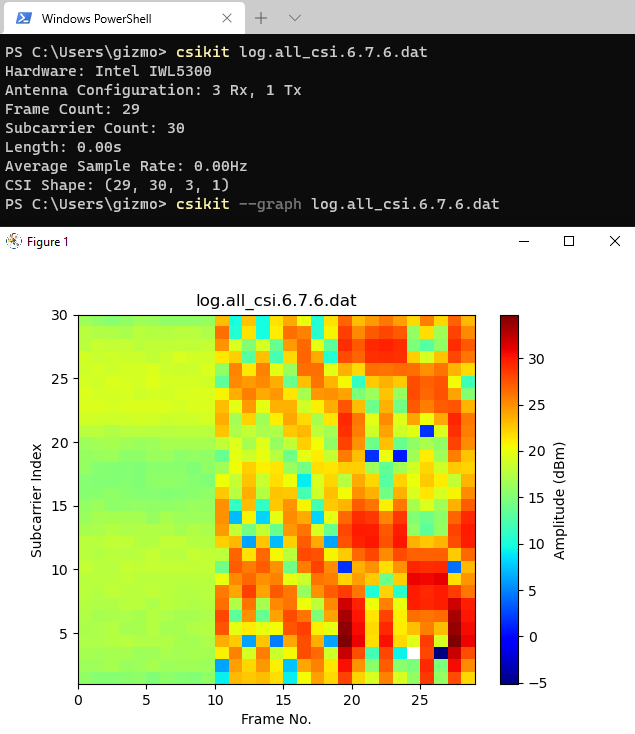

# CSIKit [](https://badge.fury.io/py/CSIKit)

Tools for extracting Channel State Information from files produced by a range of WiFi hardware/drivers, written in Python with numpy. 

Python 3.5+ required.

- **CSI parsing** from .pcap and .dat files.
- **Processing** and **Visualisation** using numpy and matplotlib.
- **CSV generator** for dataset serialisation.
- **Libraries** for parsing CSI for your own Python applications.

<p align="center">
  
</p>

- [Description](#Description)
- [Installation](#Installation)
- [Options](#Options)
- [Example](#Example)
- [Library](#Library)
- [Supported Hardware](#Supported-Hardware)
- [Known Issues](#Known-Issues)
- [Coming Soon](#Coming-Soon)
- [Mistakes and Tests](#Mistakes-and-Tests)
- [Reference Links](#Reference-Links)
- [License](#License)

## Description

**CSIKit** is a framework aimed at assisting data scientists, researchers and other programmers with performing experiments and tests using CSI-capable WiFi hardware. 

While the various public extraction toolkits do include scripts for parsing CSI data from their specific formats, these are largely written for MATLAB. Given the increasing focus on using deep learning in CSI experimentation, Python tools for parsing and processing CSI data may be more desirable for some. This is aimed at improving the accessibility of CSI research for those who may be interested in the area but have little experience with network engineering.

As is usually the case with research-oriented software, documentation is in-progress.

CSIKit provides a command line tool for parsing, processing, converting, and visualisation of CSI data, as well as libraries for use in other Python applications such as those working with Tensorflow, PyTorch, etc.

```
csikit [OPTIONS] file[.pcap/.dat]
```

## Installation

CSIKit can be used directly from source, or installed via pip.

```
pip install csikit
```

## Options

```
--info, -i              Print information about the CSI contained in a given file (hardware, configuration, shape, etc).


--graph, -g             Visualise CSI data using matplotlib.

    --graph-type TYPE   Select a graph type for visualisation: ["heatmap" (default), "all_subcarriers", "subcarrier_filter"]

--csv, -c               Write CSI data to CSV file.
                        # Currently this writes all (scaled, where applicable) subcarrier amplitudes from the first antenna stream to each row.
    --csv-dest FILE     Provide a destination for the output CSV file. (Default: output.csv)
                        
```

Additional options for each mode are to be added in the near future.

## Example

### CSIKit CLI

```
csikit log.all_csi.6.7.6.dat
csikit --graph --graph-type all_subcarriers log.all_csi.6.7.6.dat
csikit --csv log.all_csi.6.7.6.dat
```

### CSIKit library

Intel IWL5300 example:

```
from CSIKit import IWLBeamformReader

reader = IWLBeamformReader("log.all_csi.6.7.6.dat")
```

Raspberry Pi 4 example:

```
from CSIKit import NEXBeamformReader

reader = NEXBeamformReader("walk_1597159475.pcap")
```

## Library

There are 3 major components which CSIKit exposes for use in other Python applications. As other sections of code become more refined, this will likely grow over time.

Note: This documentation is initial and brief. More will follow shortly.

A BeamformReader is used to read a given CSI capture file and generate parsed traces and matrices. As each file format differs a significant amount, different readers are necessary for each piece of hardware.

### IWLBeamformReader

IWLBeamformReader can read .dat files generated through Linux 802.11n CSI Tool's `log_to_file` tool.
The class can be imported from the main CSIKit module as seen in the example above.

Once a valid file has been loaded, an IWLBeamformReader object will have a `csi_trace` attribute. This will be structured as follows.

- IWLBeamformReader (instance)
    - csi_trace (list)
        - timestamp_low (int): Timestamp indicating the current state of the IWL5300's built-in clock.
        - bfee_count (int): Index of the frame out of all those observed during uptime.
        - n_rx (int): Number of receiving antennas present.
        - n_tx (int): Number of transmitting antennas present.
        - rssi_a (int): Observed RSSI on the first Rx antenna.
        - rssi_b (int): Observed RSSI on the second Rx antenna (if present).
        - rssi_c (int): Observed RSSI on the third Rx antenna (if present).
        - noise (int): Current noise floor.
        - agc (int): Automatic gain control setting.
        - antenna_sel (int): Bitmask indicating the permutation setting.
        - length (int): Reported length of a CSI payload.
        - rate (int): Bitmask indicating the rate at which this frame was sent.
        - perm (list): Permuation options used for the CSI matrix.
        - csi (np.array): Matrix of CSI values stored as complex numbers.   
        - scaled_csi (np.array) (OPTIONAL): If the reader's `scaled` option is set, an additional scaled matrix will be generated which will return the CSI values to their absolute scale rather than Intel's internal scaling.

This class also includes code comments which may prove useful in understanding how these CSI matrices are generated. I have aimed to make this code as efficient and readable as possible.

### NEXBeamformReader

NEXBeamformReader can read .pcap files generated by `tcpdump` on devices using `nexmon_csi`. For now this code only supports the BCM43455c0.
The class can be imported from the main CSIKit module as seen in the example above.

Once a valid file has been loaded, a NEXBeamformReader object will have a `csi_trace` attribute. This will be structured as follows.

- NEXBeamformReader (instance)
    - filename (string): Path used for the .pcap file.
    - chip (string): Hardcoded string used to indicate the specific BCM chipset.
    - pcap (object):
        - magic_number (int):  See [Wireshark Documentation](https://wiki.wireshark.org/Development/LibpcapFileFormat#Global_Header) for better explanation.
        - version_major (int): ^
        - version_minor (int): ^
        - thiszone (int): ^
        - sigfigs (int): ^
        - network (int): ^
        - frames (list): Parsed frames which are packed into the csi_trace.
    - csi_trace (list)
        - timestamp_low (int): Absolute epoch timestamp.
        - header:
            - magic_bytes: Marker bytes indicating the start of a `nexmon_csi` payload.
            - source_mac: MAC address for the device which sent the packet.
            - sequence_no: 
            - core:
            - spatial_stream: 
            - channel_spec: Channel configuration, hex representation of the selected channel and bandwidth pairing.
            - chip: Reported chip version.
        - csi (np.array): Matrix of CSI values stored as complex numbers.

### csitools

This code is largely incomplete and will eventually serve more general purposes.

For now, it is effective for retrieving CSI amplitude values from the first antenna stream.

Example:

```
from CSIKit import csitools
from CSIKit import NEXBeamformReader

reader = NEXBeamformReader("walk_1597159475.pcap")
csi_matrix = get_CSI(reader)
```

The returned tuple contains a modified matrix which contains CSI amplitudes in dBm, followed by the number of frames and subcarriers contained therein.

## Supported Hardware

 - Intel IWL5300

 - Broadcom BCMs43455c0

## Known Issues

 - CSVs and Visualisations always assume you want to view the first antenna stream.
    - If this affects you, reach out to me.
    - I am interested as to how you make use of multiple streams.
 - nexmon_csi pcaps generated with non-43455c0 hardware will be parsed incorrectly. 
    - I only have 43455c0 hardware to generate data with, so I have been unable to spend time with others.
    - BCM hardware will have to be detected from file headers.
    - Once additional hardware support is completed, this will be resolved.


## Coming Soon

### Visualisation

Additional graphing and visualisation options. Some of these exist in the `legacy` folder, however these are unrefined and difficult to read.

### Additional Hardware support.
Additional **[nexmon_csi](https://github.com/seemoo-lab/nexmon_csi)** compatible hardware.

Atheros.

ESP32.

## Mistakes and Tests

If anything is wrong, [let me know](mailto:g.r.forbes@rgu.ac.uk). I want to know why.

I'm a PhD student working on several sensor data-focussed experiments, a few of which involve using CSI. This means I'm not an RF engineer or particularly experienced this area. I've done and are doing as much as I can to make sure that anything produced with this is accurate. To that end, there are MATLAB .mat files included in the `tests` folder which have been generated using IWLBeamformReader, NEXBeamformReader, and scipy's `savemat` method. There are also MATLAB scripts in the `scripts` folder which can be used to check the validity of the output from this tool. In my experience I have found these tools to produce identical output to the MATLAB scripts offered by the following developers. If this is not the case, let me know.

Further to that, if there are any assertions I have made within code comments or otherwise which are factually incorrect, again let me know. I want to learn as much about this area as I reasonably can.

## Reference Links

- **[Linux 802.11n CSI Tool](https://dhalperi.github.io/linux-80211n-csitool/)**: CSI extraction suite for Intel IWL5300 hardware.
    - This project was released by [Daniel Halperin](http://github.com/dhalperi).
- **[nexmon_csi](https://github.com/seemoo-lab/nexmon_csi)**: CSI extraction suite for a range of Broadcom WiFi hardware.
    - This project was released by the [Secure Mobile Networking Lab](https://github.com/seemoo-lab). 

## License

The code in this project is licensed under MIT license.